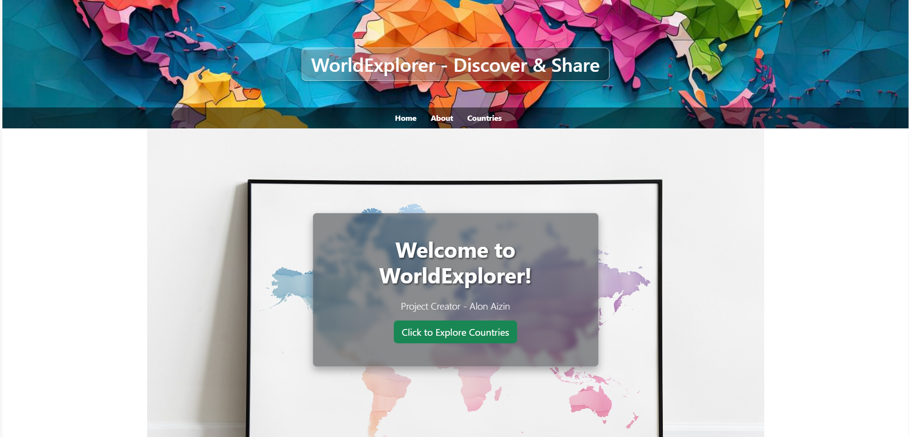
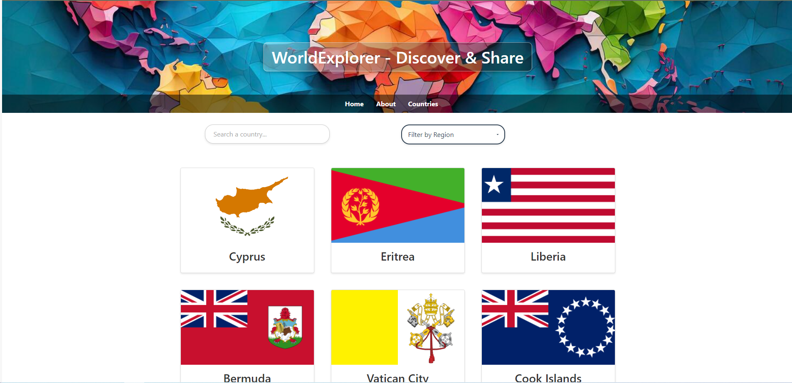
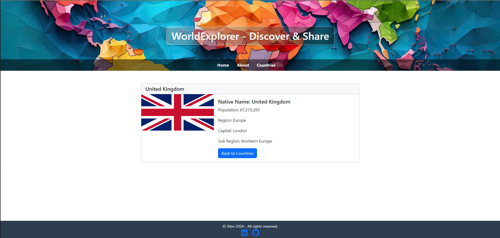

# Project Name: WorldExplorer

## Introduction

WorldExplorer is an interactive web application designed to bring the rich diversity of the world's countries to your fingertips. With WorldExplorer, users can discover detailed information about different countries, including demographics, cultural insights, and geographical data, enhancing their global knowledge and understanding.

## Features

- **Country Discovery**: Explore information on over 190 countries, including capital cities, population stats, and regional data.
- **Interactive Maps**: Visualize countries on a global map for geographical context.
- **Cultural Insights**: Learn about the cultures, languages, and flags of various nations.
- **Search Functionality**: Quickly find countries using the intuitive search feature.

## Technologies Used

- React.js for the frontend UI.
- Node.js and Express for the backend server (if applicable).
- RESTful APIs for fetching country data.
- Bootstrap and custom CSS for styling.

## Project Screenshots

Below are some highlights of WorldExplorer in action:

### Main Interface

### Country Details View

### Search Functionality

